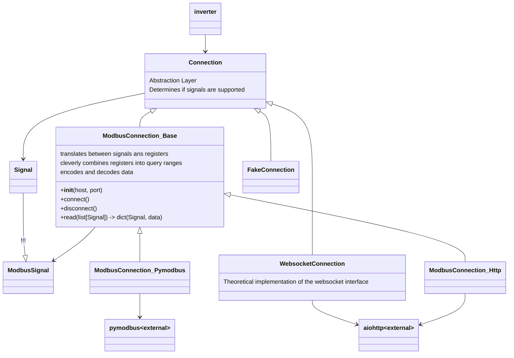

# Architecture in Core

```mermaid
classDiagram
    class inverter
    class Connection {
        Abstraction Layer
        Determines if signals are supported
    }
    class Signal
    class ModbusSignal
    class ModbusConnection_Base {
        translates between signals ans registers
        cleverly combines registers into query ranges
        encodes and decodes data
        +__init__(host, port)
        +connect()
        +disconnect()
        +read(list[Signal]) -> dict(Signal, data)
    }
    class ModbusConnection_Pymodbus
    class ModbusConnection_Http
    class pymodbus~external~

    class aiohttp~external~
    class WebsocketConnection {
        Theoretical implementation of the websocket interface
    }

    Signal --|> ModbusSignal : !!!
    inverter --> Connection
    Connection --> Signal

    Connection <|-- ModbusConnection_Base
    Connection <|-- FakeConnection

    Connection <|-- WebsocketConnection
    WebsocketConnection --> aiohttp

    ModbusConnection_Base <|-- ModbusConnection_Pymodbus
    ModbusConnection_Base <|-- ModbusConnection_Http

    ModbusConnection_Base --> ModbusSignal

    ModbusConnection_Http --> aiohttp

    ModbusConnection_Pymodbus --> pymodbus
```
