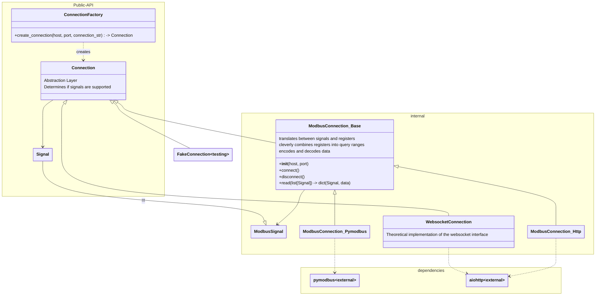
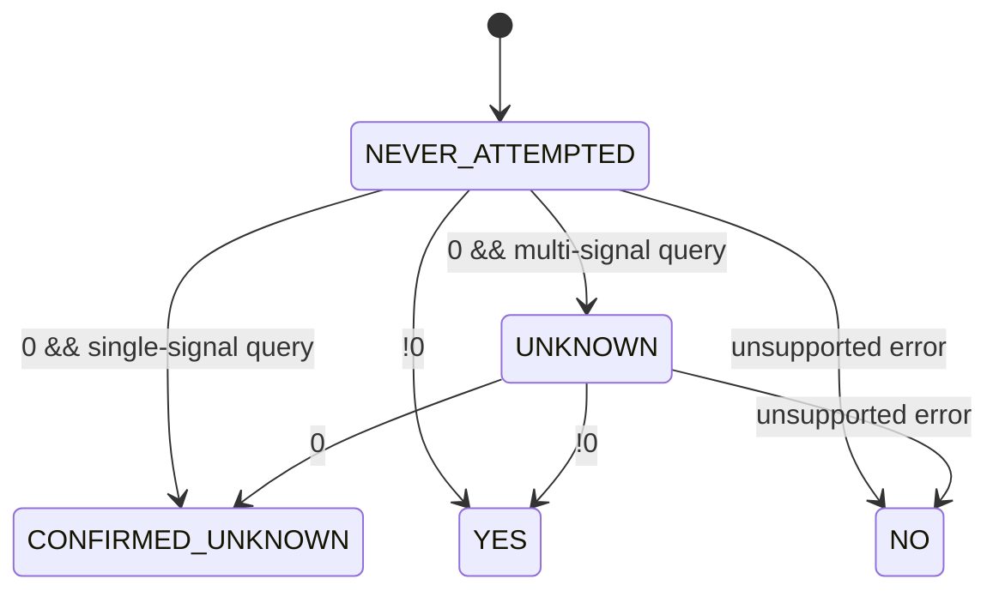

# Connection

`core.connection` is a "mid level" abstraction layer. It provides a connection to the inverter and reads signals from it. It is not home assistant specific.

It will:
* provide a generic interface to connect to the inverter
* read signals from the inverter
* decode signals
* detect which signals are supported
* handle the connection to the inverter (reconnects, token refreshes, etc)
* cleverly combine modbus queries into appropriate modbus ranges
* provide complex signals, such as date construction based on other signals

It will not:
* include any home assistant specific code
* support any signal specific code, or a list of signals

It contains sungrows specifics:
* detection of supported signals seems to be a sungrow specific problem
* the connection methods to the inverter are sungrow specific (modbus, http, websocket)

The idea is to keep this layer as generic as possible, so it can be reused in other projects. With the exclusion of certain topics, this layer should be rather stable once it is finished. Only when sungrow changes their protocol, this layer needs to be updated.

It's somewhat comparable to [SungrowClient](https://github.com/bohdan-s/SungrowClient), however with a more generic approach.

`core.connection` is deliberately designed in a way that allows it to be extracted from the rest of this extension and used in other projects. It is a generic abstraction layer for connecting to sungrow inverters and reading signals from them.

Once everything has stabilized, it will be moved to its own repository.

## State machine for signal supported flag

Note: Sungrow inverters return 0 for unsupported signals when they are queried together with other signals. Therefore any 0 response is ambiguous and requires a follow-up query with only the signal in question.

