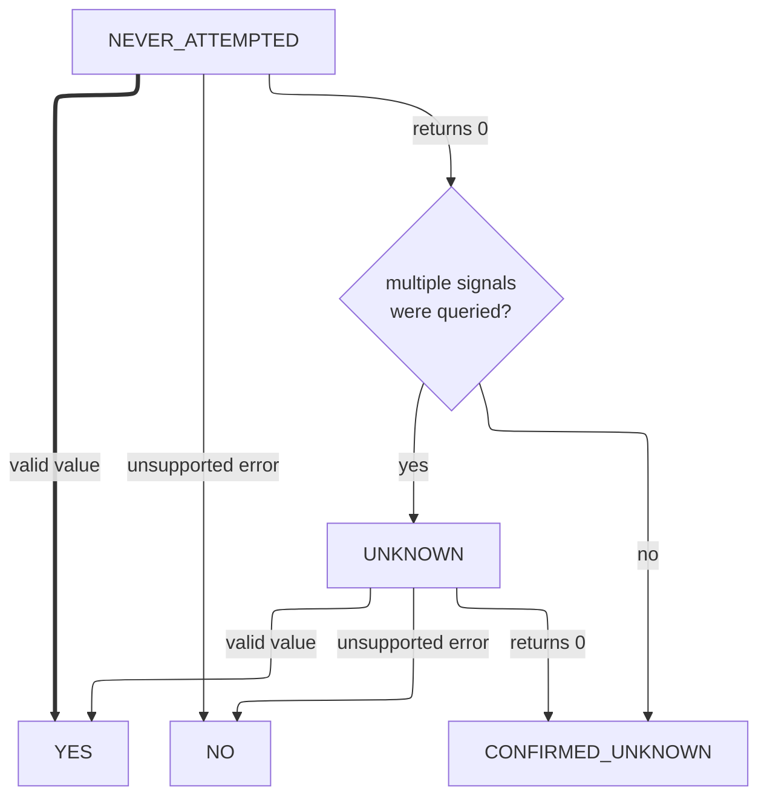
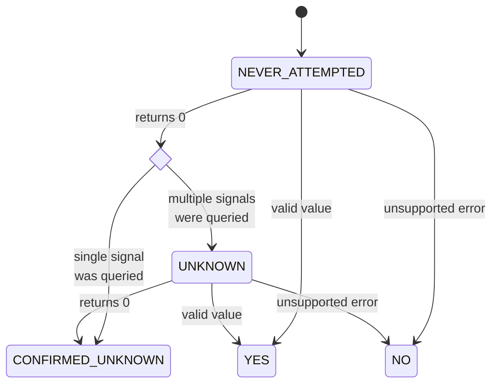

```mermaid
%%{init: {"flowchart": {"defaultRenderer": "elk"}} }%%
graph
    first_query_unknown{multiple signals <br/> were queried?}

    NEVER_ATTEMPTED ==valid value=======> YES
    NEVER_ATTEMPTED --unsupported error--> NO
    NEVER_ATTEMPTED --returns 0--> first_query_unknown

    first_query_unknown -- yes --> UNKNOWN
    first_query_unknown -- no --> CONFIRMED_UNKNOWN

    UNKNOWN --returns 0--> CONFIRMED_UNKNOWN
    UNKNOWN --valid value--> YES
    UNKNOWN --unsupported error--> NO
```

```mermaid
stateDiagram
    [*] --> NEVER_ATTEMPTED

    state first_query_unknown <<choice>>
    NEVER_ATTEMPTED --> first_query_unknown: returns 0
    NEVER_ATTEMPTED --> YES: valid value
    NEVER_ATTEMPTED --> NO: unsupported error

    first_query_unknown --> UNKNOWN: multiple signals <br/> were queried
    first_query_unknown --> CONFIRMED_UNKNOWN: single signal <br/> was queried
    
    UNKNOWN --> CONFIRMED_UNKNOWN: returns 0
    UNKNOWN --> YES: valid value
    UNKNOWN --> NO: unsupported error
```
