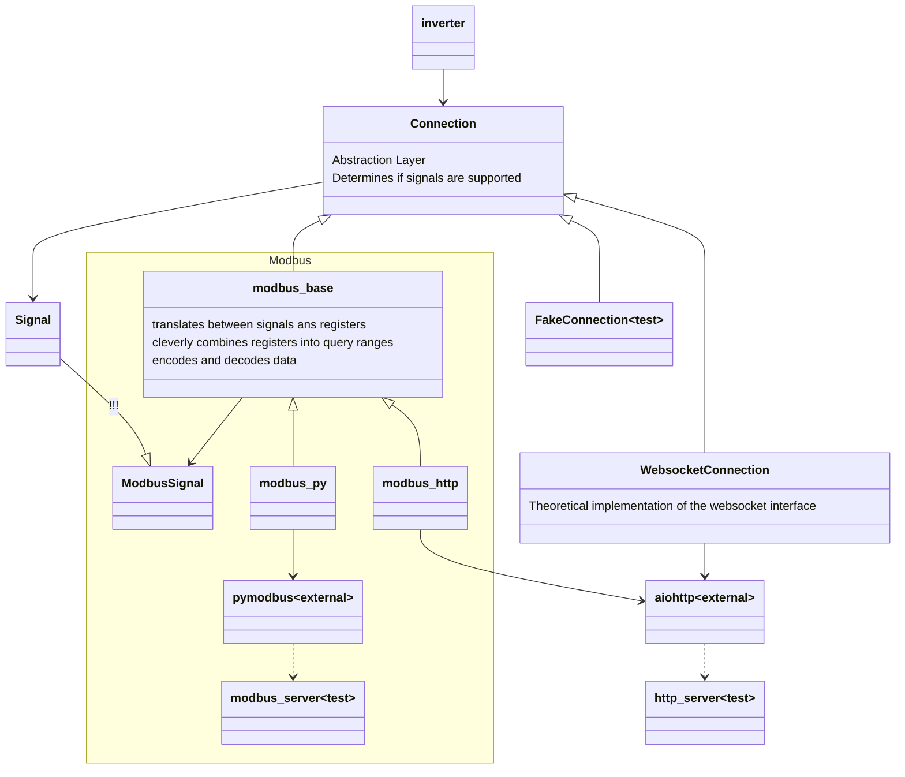

# Tests

## Test Levels in "Core"-Tests

Some tests are true end to end tests, and create a modbus / http server.
However that's quite some overhead, both in complexity and runtime.

It's quite a lot faster to mock the pymodbus library. These tests can run without opening any sockets.
This sounds quite nice, however mocking is somewhat inconvenient.
Probably because of my lack of experience with python mocking :-(
Another problem is that the test data on this level is encoded, and therefore not very readable.

Therefore, for me, it's much easier to work with dependency injection.
Most tests (future) inject a modbus stub, which does not use pymodbus or http at all.
These tests test all the actual business logic (and the modbus_base class).
FIXME: data is still encoded here!! Fake modbus_base instead?!

## Directory structure

While we have the different tests as described above, it actually does not matter much, on which level the tests are run.
It's much more important whether those tests are fast or slow.
